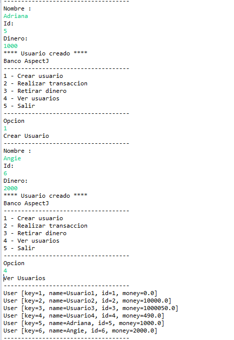
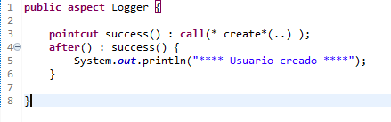
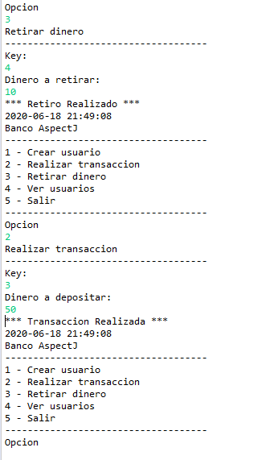
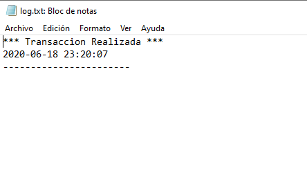

# Taller2_AOP
## Diseño de Software
## Paralelo 2
### **Integrantes:**
- ANGIE PATRICIA ARGUDO DUARTE 
- ADRIANA BRIGITTE GUILINDRO GARCES
- MANUEL ALEJANDRO LOOR MACIAS

### Funcionamiento del aspecto de ejemplo "Usuario creado"

### Aspecto Logger.aj

### Parte 3: Presentación por pantalla

### Parte 3: Archivo log.txt

